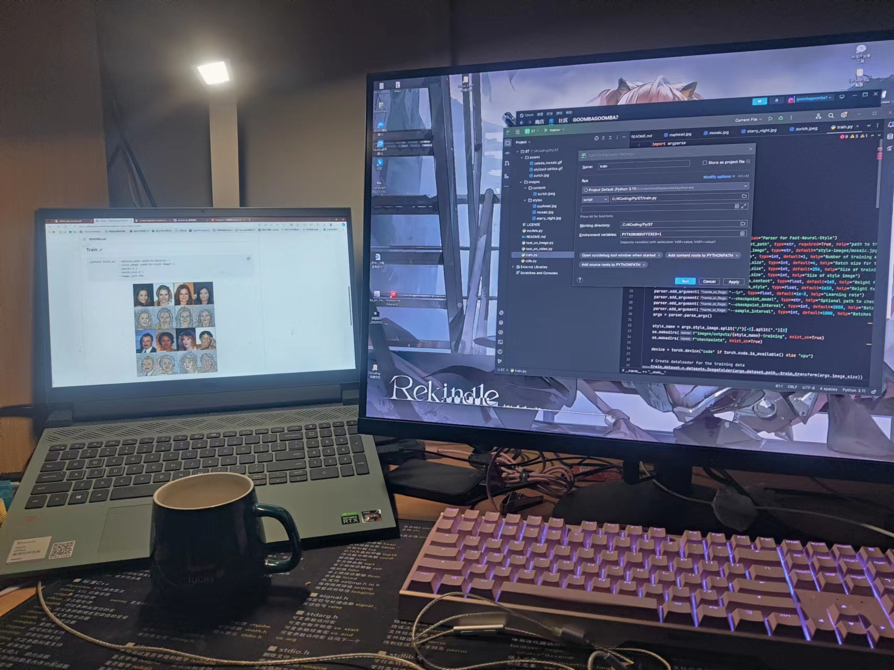
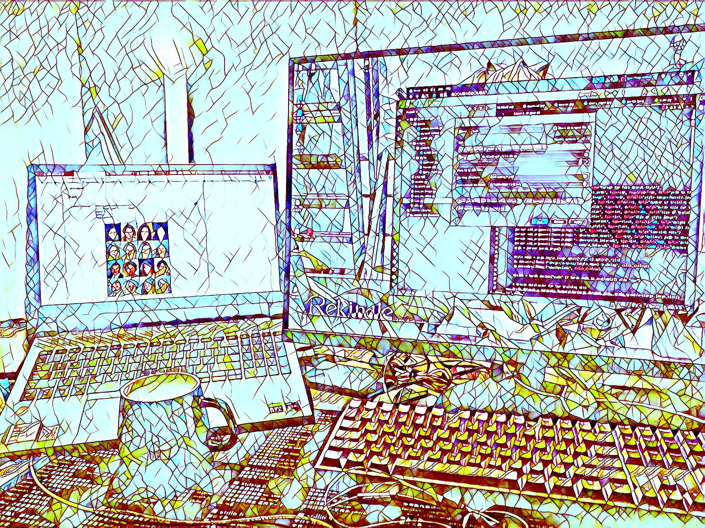

# Style Transfer Sample in PyTorch

[Fast Neural Style Transfer](https://cs.stanford.edu/people/jcjohns/eccv16/) ([official Lua implementation](https://github.com/jcjohnson/fast-neural-style)）Pytorch实现

参考 [@eriklindernoren](https://github.com/eriklindernoren) 的[Fast Neural Style Transfer in PyTorch](https://github.com/eriklindernoren/Fast-Neural-Style-Transfer/tree/master)

使用[MSCOCO2017](https://cocodataset.org/#home)训练

<p align="center">
    
    
</p>
<p align="center">
    
</p>

## Train

```
python train.py  --dataset_path <path-to-dataset> \
                 --style_image <path-to-style-image> \
                 --epochs 1 \
                 --batch_size 4 \
                 --image_size 256
```

## Test on Image

```
python image_test.py  --image_path <path-to-image> \
                         --checkpoint_model <path-to-checkpoint> \
```